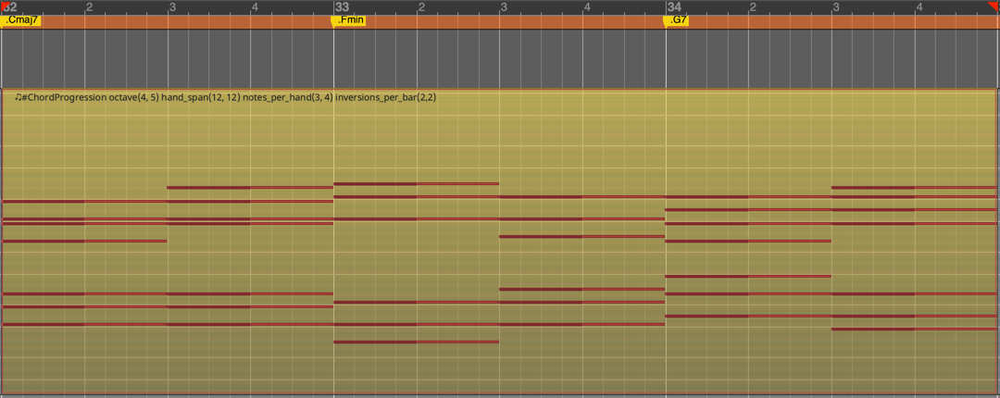

# Ardour Chord Progression Script

## Introduction

This Lua script for Ardour DAW automatically generates a chord progression within selected MIDI regions. It uses location markers to define the chords in the progression, allowing you to easily create complex harmonic structures.
Each time a progression is generated it will be slightly different, so keep regenerating till you get one that you like.


## Installation

Download the latest version of the script from the releases section here on GitHub:


From the assets sectikon download the compressed archive:


Ardour searches for Lua scripts in the scripts folder in $ARDOUR_DATA_PATH, Apart from scripts included directly with Ardour, this includes

```commandline
GNU/Linux:	$HOME/.config/ardour8/scripts
Mac OS X:	$HOME/Library/Preferences/Ardour8/scripts
Windows:	%localappdata%\ardour8\scripts
```

In order to be ab le to execute the script you need to add it into one of the available slots in the `Edit/Lua Scripts/Script Manager` option:


Select `[A] Chord progression" from the list of action scripts`


Save downloaded chord-progression.lua script into the folder per your operating system.

## Usage

1. **Create Location Markers:** Define your chord progression by creating location markers in the editor. Each marker name should start with a dot (`.`) followed by the chord symbol (e.g., `.Cmaj7`, `.Fmin`, `.G7`).
2. **Create or Select MIDI Regions:** Create empty MIDI regions or select existing ones where you want the chord progression to be generated.
3. **Name the MIDI Regions:** Rename each MIDI region to start with `#ChordProgression`. You can also add configuration parameters to the region name, as described below.
4. **Run the Script:** Select the MIDI regions containing the `#ChordProgression` prefix and run the script. It will analyze the location markers and generate MIDI notes for the specified chords within the regions.

## Configuration Parameters

You can customize the chord generation process by adding configuration parameters to the MIDI region names. These parameters are added after the `#ChordProgression` prefix and separated by whitespace. Each parameter has its values enclosed in parentheses. Here's a breakdown of the parameters:

### octave(left hand, right hand)

* **Description:** Sets the base octave for each hand.
* **Default:** `octave(3, 5)` (Left hand starts at octave 3, right hand starts at octave 5)
* **Example:** `#ChordProgression octave(4, 6)` (Left hand starts at octave 4, right hand starts at octave 6)

### hand_span(left hand, right hand)

* **Description:** Limits the maximum interval between the highest and lowest notes played by each hand. This helps to ensure playability.
* **Default:** `hand_span(13, 13)` (13 semitones for both hands)
* **Example:** `#ChordProgression hand_span(10, 12)` (Left hand has a maximum span of 10 semitones, right hand has a maximum span of 12 semitones)

### notes_per_hand(left hand, right hand)

* **Description:** Controls the maximum number of notes played simultaneously by each hand.
* **Default:** `notes_per_hand(3, 4)` (Left hand plays up to 3 notes, right hand plays up to 4 notes)
* **Example:** `#ChordProgression notes_per_hand(2, 3)` (Left hand plays up to 2 notes, right hand plays up to 3 notes)

### inversions_per_bar(left hand, right hand)

* **Description:** Defines how many times the chord inversion should change within each bar. A value of **0 means one inversion change per chord change**. A value of 1 means one inversion change at the beginning of each bar, and higher values represent multiple inversion changes per bar.
* **Default:** `inversions_per_bar(0, 0)` (One inversion change per chord change for both hands)
* **Example:** `#ChordProgression inversions_per_bar(1, 2)` (Left hand changes inversion once per bar, right hand changes inversion twice per bar)

### channel(left hand, right hand)

* **Description:** Specifies the MIDI channel for each hand.
* **Default:** `channel(0, 0)` (Both hands on MIDI channel 1)
* **Example:** `#ChordProgression channel(0, 1)` (Left hand on MIDI channel 1, right hand on MIDI channel 2)

### velocity(left hand, right hand)

* **Description:** Determines the MIDI velocity (volume) for each hand.
* **Default:** `velocity(64, 64)` (Velocity 64 for both hands)
* **Example:** `#ChordProgression velocity(80, 100)` (Left hand velocity 80, right hand velocity 100)

### note_gap(left hand, right hand)

* **Description:** Creates gaps between notes by shortening note duration by specified number of ticks. 
* **Default:** `note_gap(0, 0)` (There are no note gaps)
* **Example:** `#ChordProgression note_gap(30, 30)` (Creates note gap of 30 ticks for both hands)

### pattern(left hand, right hand)

* **Description:** Simple rhythm pattern. Defined as number of chords repeats per bar, at beats defined in pattern. 0 means no repeats, 2 means two chord repeats per bar. Negative value indicates swing nots, for example -12 would create triples with swing notes. Chords are repeated with the same inversion as the previous ones. Note that inversions also count as chord triggers and repeats are combined together with repeats.
* **Default:** `pattern(0, 0)` (There are no chord repeats)
* **Example:** `#ChordProgression pattern(4, 8) inversions_per_bar(2, 2)` (Four chord repeats per bar on the left hand: two per inversion and 8 chord repeats on the right hand: four per inversion)

## Supported chord types

```lua
        -- Basic triads and seventh chords
        ['major'] = { 0, 4, 7 },
        ['maj'] = { 0, 4, 7 },
        ['minor'] = { 0, 3, 7 },
        ['min'] = { 0, 3, 7 },
        ['m'] = { 0, 3, 7 },
        ['7'] = { 0, 4, 7, 10 },
        ['maj7'] = { 0, 4, 7, 11 },
        ['min7'] = { 0, 3, 7, 10 },
        ['dim'] = { 0, 3, 6 },
        ['aug'] = { 0, 4, 8 },

        -- Ninth, eleventh, and thirteenth chords
        ['7/9'] = { 0, 4, 7, 10, 14 },
        ['9'] = { 0, 4, 7, 10, 14 },
        ['min9'] = { 0, 3, 7, 10, 14 },
        ['maj9'] = { 0, 4, 7, 11, 14 },
        ['11'] = { 0, 4, 7, 10, 14, 17 },
        ['maj11'] = { 0, 4, 7, 11, 14, 17 },
        ['min11'] = { 0, 3, 7, 10, 14, 17 },
        ['13'] = { 0, 4, 7, 10, 14, 17, 21 },
        ['maj13'] = { 0, 4, 7, 11, 14, 21 },
        ['min13'] = { 0, 3, 7, 10, 14, 21 },

        -- Altered dominants
        ['7b5'] = { 0, 4, 6, 10 },
        ['7#5'] = { 0, 4, 8, 10 },
        ['7b9'] = { 0, 4, 7, 10, 13 },
        ['7#9'] = { 0, 4, 7, 10, 15 },
        ['7b13'] = { 0, 4, 7, 10, 20 },
        ['7#11'] = { 0, 4, 7, 10, 18 },

        -- Added tone chords
        ['add9'] = { 0, 4, 7, 14 },
        ['min(add9)'] = { 0, 3, 7, 14 },
        ['add11'] = { 0, 4, 7, 17 },
        ['add13'] = { 0, 4, 7, 21 },
        ['min(add11)'] = { 0, 3, 7, 17 },

        -- Suspended chords
        ['sus2'] = { 0, 2, 7 },
        ['sus4'] = { 0, 5, 7 },
        ['sus2/b7'] = { 0, 2, 7, 10 },
        ['sus4/b7'] = { 0, 5, 7, 10 },

        -- Complex chords
        ['maj7#11'] = { 0, 4, 7, 11, 18 },
        ['min(maj7)'] = { 0, 3, 7, 11 },
        ['dim(maj7)'] = { 0, 3, 6, 11 },
        ['7b13'] = { 0, 4, 7, 10, 20 },

        -- Diminished and augmented variations
        ['dim7'] = { 0, 3, 6, 9 },
        ['min7b5'] = { 0, 3, 6, 10 },
        ['aug7'] = { 0, 4, 8, 10 }

```
## Examples

To create a chord progression with Cmaj7, Fmin, and G7 chords, starting at octave 4 for both hands, with a maximum hand span of 12 semitones, and 3 notes per hand, you would:

1. Create location markers named `.Cmaj7`, `.Fmin`, `.G7`.
2. Create a MIDI region and name it `#ChordProgression octave(4, 5) hand_span(12, 12) notes_per_hand(3, 4)`.
3. Run the script.


Now change the #ChordProgression settings to make two inversions per bar for both hands:`#ChordProgression octave(4, 5) hand_span(12, 12) notes_per_hand(3, 4) inversions_per_bar(2,2)`



This is an example of generating a walking bass line. This is done by playing only left hand and reducing number of notes per chord to one.

Chord progression settings: `#ChordProgression octave(2,5) notes_per_hand(1, 0)  hand_span(13,13) channel(0,0) inversions_per_bar(8,2) velocity(100,0)`


This is an example of triplets on the right hand and walking bass on the left hand. 
Note gap is added for the left hand to emphasize the rhythm pattern

Chord progression settings:`#ChordProgression channel(0,1) octave(3, 5) pattern(4,12) inversions_per_bar(0,2) note_gap(40,120) notes_per_hand(1,4)`


This is an example of triplets on the right hand with swing notes and walking bass on the left hand. 
Pattern for right hand is defined as a negative value so that swing triplets are generated. 
Note gap is added for the left hand to emphasize the rhythm pattern.

Chord progression settings:`#ChordProgression channel(0,1) octave(3, 5) pattern(4,-12) inversions_per_bar(0,2) note_gap(120,120) notes_per_hand(1,4)`


## Author

Frank Povazanj

## License

MIT


