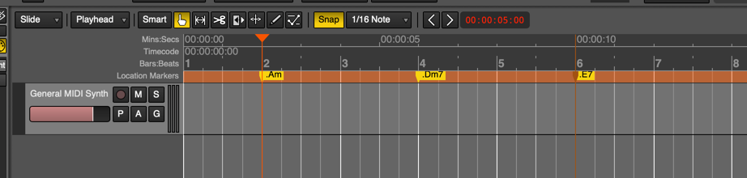

# Ardour Chord Progression Script

## Introduction

This Lua script for Ardour DAW automatically generates a chord progression within selected MIDI regions. It uses location markers to define the chords in the progression, allowing you to easily create complex harmonic structures.
Each time a progression is generated it will be slightly different, so keep regenerating till you get one that you like.

Script generates parallel progressions for left and right hand. There are many parameters which can be tweaked to customize the generated notes.

Script can generate solid chords, arpeggios and random patterns.


## Installation

Download the latest version of the script from the releases section here on GitHub:


From the assets sectikon download the compressed archive:


Ardour searches for Lua scripts in the scripts folder in $ARDOUR_DATA_PATH, Apart from scripts included directly with Ardour, this includes

```commandline
GNU/Linux:	$HOME/.config/ardour8/scripts
Mac OS X:	$HOME/Library/Preferences/Ardour8/scripts
Windows:	%localappdata%\ardour8\scripts
```

Save downloaded chord-progression.lua script into the folder per your operating system.

In order to be able to execute the script you need to add it into one of the available slots in the `Edit/Lua Scripts/Script Manager` option:


Select `[A] Chord progression" from the list of action scripts`


## Usage

### Create MIDI track(s)

You can use an existing MIDI track or create new one. To create a new MIDI track, select "Track/Add track/Bus/VCA" option in the menu.


### Create location markers

Define your chord progression by creating location markers in the editor. Markers should be placed at the points where chords are changing. 
Each marker name should start with a dot (`.`) followed by the chord symbol (e.g., `.Cmaj7`, `.Fmin`, `.G7`).

There are a number of ways to create new markers in Ardour. First make sure that the location markers and Bars:Beats lines is showing in the editor:


Now right-click on the position of the first chord, then select "New Location Marker" option:


New location marker will show:


Now double-click on the newly created marker and rename it to the chord in your progression. Make sure it is prefixed with a dot (`.`). For example Am will be .Am


For example this will be a simple chord progression:



### Create or select MIDI regions for the chord progression

Create empty MIDI regions or select existing ones where you want the chord progression to be generated.

Make sure the pencil tool is selected in the toolbar and then paint the region in the MIDI track. This region will hold the generated MIDI notes for the chord progression.
For example here we have a 6-bar MIDI region:


Now rename each MIDI region to `#ChordProgression`. Configuration parameters will be added later as needed. Double click on the region and update its name in the dialog box:


### Run the ChordProgression script

Select the MIDI regions containing the `#ChordProgression` prefix and run the script. Script will analyze the location markers and generate MIDI notes for the specified chords within the regions.
If only one MIDI region is selected you will be presented with a dialog box where you can change the default configuration for the region. 
If multiple MIDI regions are selected script will use the existing region configuration to generate or regenerate the progression notes.

To run the script navigate to "Edit/Lua scripts" and select chord progression script from the list:


These are the parameters that can be selected for a chord progression region:


To test the script, simply click ok and the default values will be used to generate MIDI notes for the progression. 
Later on you can modify the parameters in the dialog to customize the progression generator.

For example, this would be a generated progression:


## Configuration Parameters

You can customize the chord generation process by changing them in the config dialog box or adding configuration parameters to the MIDI region names (this is usefull if you want to copy the same config from one region to another). 
These parameters are added after the `#ChordProgression` prefix and separated by whitespace. Each parameter has its values enclosed in parentheses. Here's a breakdown of the parameters:

### octave(left hand, right hand)

* **Description:** Sets the base octave for each hand.
* **Default:** `octave(3, 5)` (Left hand starts at octave 3, right hand starts at octave 5)
* **Example:** `#ChordProgression octave(4, 6)` (Left hand starts at octave 4, right hand starts at octave 6)

### hand_span(left hand, right hand)

* **Description:** Limits the maximum interval between the highest and lowest notes played by each hand. This helps to ensure playability.
* **Default:** `hand_span(13, 13)` (13 semitones for both hands)
* **Example:** `#ChordProgression hand_span(10, 12)` (Left hand has a maximum span of 10 semitones, right hand has a maximum span of 12 semitones)

### notes_per_hand(left hand, right hand)

* **Description:** Controls the maximum number of notes played simultaneously by each hand.
* **Default:** `notes_per_hand(3, 4)` (Left hand plays up to 3 notes, right hand plays up to 4 notes)
* **Example:** `#ChordProgression notes_per_hand(2, 3)` (Left hand plays up to 2 notes, right hand plays up to 3 notes)

### inversions_per_bar(left hand, right hand)

* **Description:** Defines how many times the chord inversion should change within each bar. A value of **0 means one inversion change per chord change**. A value of 1 means one inversion change at the beginning of each bar, and higher values represent multiple inversion changes per bar.
* **Default:** `inversions_per_bar(0, 0)` (One inversion change per chord change for both hands)
* **Example:** `#ChordProgression inversions_per_bar(1, 2)` (Left hand changes inversion once per bar, right hand changes inversion twice per bar)

### channel(left hand, right hand)

* **Description:** Specifies the MIDI channel for each hand.
* **Default:** `channel(0, 0)` (Both hands on MIDI channel 1)
* **Example:** `#ChordProgression channel(0, 1)` (Left hand on MIDI channel 1, right hand on MIDI channel 2)

### velocity(left hand, right hand)

* **Description:** Determines the MIDI velocity (volume) for each hand.
* **Default:** `velocity(64, 64)` (Velocity 64 for both hands)
* **Example:** `#ChordProgression velocity(80, 100)` (Left hand velocity 80, right hand velocity 100)

### note_gap(left hand, right hand)

* **Description:** Creates gaps between notes by shortening note duration by specified number of ticks. 
* **Default:** `note_gap(0, 0)` (There are no note gaps)
* **Example:** `#ChordProgression note_gap(30, 30)` (Creates note gap of 30 ticks for both hands)

### pattern(left hand, right hand)

* **Description:** Simple rhythm pattern. Defined as number of chords repeats per bar, at beats defined in pattern. 0 means no repeats, 2 means two chord repeats per bar. Negative value indicates swing nots, for example -12 would create triples with swing notes (note that this is controlled by "Swing" checkbox in the dialog box). Chords are repeated with the same inversion as the previous ones. Note that inversions also count as chord triggers and repeats are combined together with repeats.
* **Default:** `pattern(0, 0)` (There are no chord repeats)
* **Example:** `#ChordProgression pattern(4, 8) inversions_per_bar(2, 2)` (Four chord repeats per bar on the left hand: two per inversion and 8 chord repeats on the right hand: four per inversion)

### play(left hand, right hand)

* **Description:** Defines how chords are played. Values are: ["Solid chords"] = 0, ["Arp up"] = 1, ["Arp up/down"] = 2, ["Arp down"] = 3, ["Arp down/up"] = 4, ["Random"] = 9. Arpeggios are interactiong with patter, octave drift and inversions per bar parameters. Experiment with combination of those to get desired patterns.
* **Default:** `play(0, 0)` (Solid chords on both hands)
* **Example:** `#ChordProgression inversions_per_bar(1,1) octave_drift(3,3) channel(0,0) hand_span(12,12) play(1,1) pattern(4,8) octave(3,5) style(jazz,jazz) velocity(64,64) note_gap(0,0) swing(false,false) notes_per_hand(3,5)` (Left hand plays up arpeggio on quarter notes, right hand plays up arpeggio on eight notes)
* **Example:**  `#ChordProgression inversions_per_bar(1,1) octave_drift(3,1) channel(0,0) hand_span(12,12) play(1,2) pattern(4,8) octave(3,5) style(jazz,jazz) velocity(64,64) note_gap(0,0) swing(false,false) notes_per_hand(3,5)` (Left hand plays up arpeggio on quarter notes, right hand plays up/down arpeggio on eight notes)
## Supported chord types

```lua
-- Basic triads and seventh chords
['major'] = { 0, 4, 7 },
['maj'] = { 0, 4, 7 },
['minor'] = { 0, 3, 7 },
['min'] = { 0, 3, 7 },
['m'] = { 0, 3, 7 },
['7'] = { 0, 4, 7, 10 },
['maj7'] = { 0, 4, 7, 11 },
['min7'] = { 0, 3, 7, 10 },
['m7'] = { 0, 3, 7, 10 },
['dim'] = { 0, 3, 6 },
['aug'] = { 0, 4, 8 },

-- Ninth, eleventh, and thirteenth chords
['7/9'] = { 0, 4, 7, 10, 14 },
['9'] = { 0, 4, 7, 10, 14 },
['min9'] = { 0, 3, 7, 10, 14 },
['m9'] = { 0, 3, 7, 10, 14 },
['maj9'] = { 0, 4, 7, 11, 14 },
['11'] = { 0, 4, 7, 10, 14, 17 },
['maj11'] = { 0, 4, 7, 11, 14, 17 },
['min11'] = { 0, 3, 7, 10, 14, 17 },
['m11'] = { 0, 3, 7, 10, 14, 17 },
['13'] = { 0, 4, 7, 10, 14, 17, 21 },
['maj13'] = { 0, 4, 7, 11, 14, 21 },
['min13'] = { 0, 3, 7, 10, 14, 21 },
['m13'] = { 0, 3, 7, 10, 14, 21 },

-- Altered dominants
['7b5'] = { 0, 4, 6, 10 },
['7#5'] = { 0, 4, 8, 10 },
['7b9'] = { 0, 4, 7, 10, 13 },
['7#9'] = { 0, 4, 7, 10, 15 },
['7b13'] = { 0, 4, 7, 10, 20 },
['7#11'] = { 0, 4, 7, 10, 18 },

-- Added tone chords
['add9'] = { 0, 4, 7, 14 },
['min(add9)'] = { 0, 3, 7, 14 },
['add11'] = { 0, 4, 7, 17 },
['add13'] = { 0, 4, 7, 21 },
['min(add11)'] = { 0, 3, 7, 17 },

-- Suspended chords
['sus2'] = { 0, 2, 7 },
['sus4'] = { 0, 5, 7 },
['sus2/b7'] = { 0, 2, 7, 10 },
['sus4/b7'] = { 0, 5, 7, 10 },

-- Complex chords
['maj7#11'] = { 0, 4, 7, 11, 18 },
['min(maj7)'] = { 0, 3, 7, 11 },
['dim(maj7)'] = { 0, 3, 6, 11 },
['7b13'] = { 0, 4, 7, 10, 20 },

-- Diminished and augmented variations
['dim7'] = { 0, 3, 6, 9 },
['min7b5'] = { 0, 3, 6, 10 },
['aug7'] = { 0, 4, 8, 10 }

```

## Author

Frank Povazanj

## License

MIT


